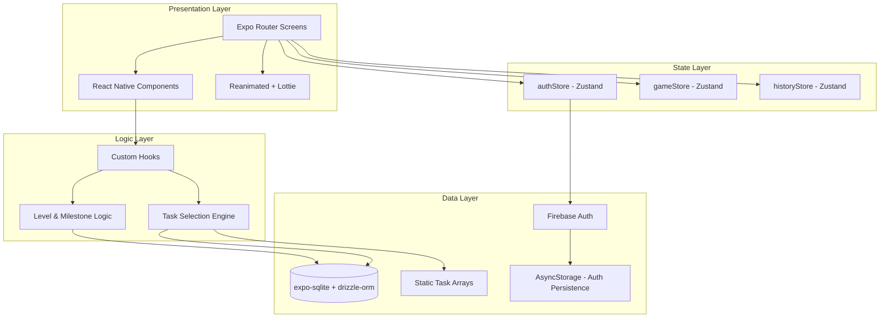
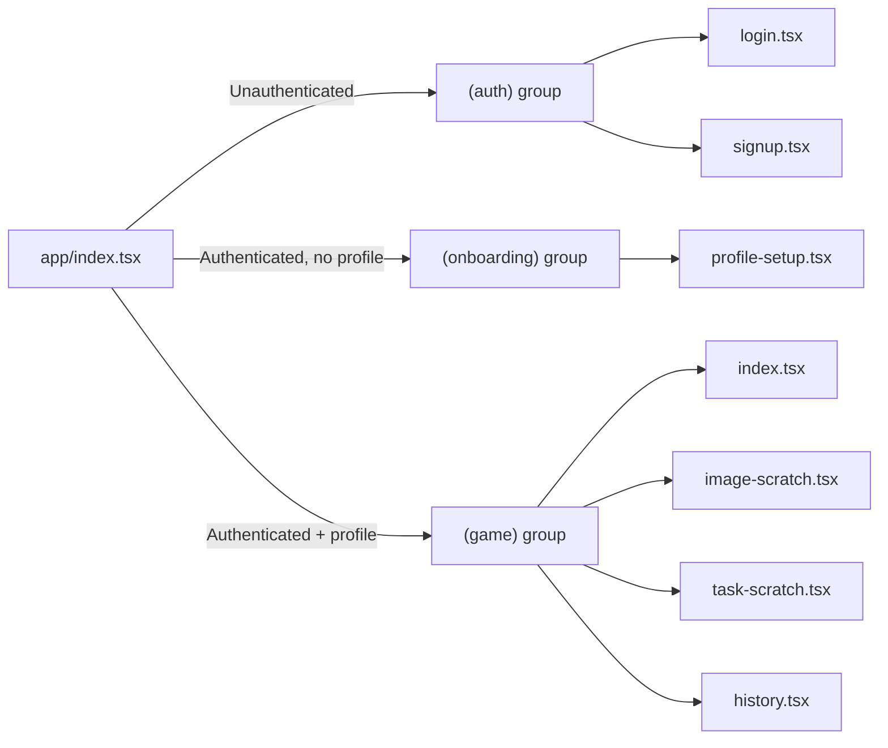
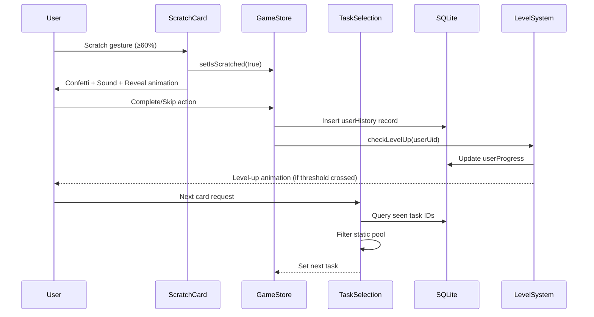

# Design Document: Couples Scratch Card Game

## Overview

The Couples Scratch Card Game is a local-first React Native (Expo) mobile application that provides an interactive, turn-based experience for romantic partners. The app centers on a scratch card mechanic where one partner scratches a virtual card to reveal a task or image that the other partner must perform or react to.

The system is designed as an offline-first application with Firebase Authentication for identity management and a local SQLite database (via expo-sqlite + drizzle-orm) for all game state persistence. The architecture prioritizes responsiveness, smooth animations, and a dating-app aesthetic using NativeWind (Tailwind CSS for React Native).

### Key Design Decisions

| Decision | Rationale |
|----------|-----------|
| Local-first SQLite | No backend server needed; instant reads/writes; works offline |
| Static task data in TypeScript arrays | Simple to maintain; no API calls; easy to expand |
| Per-user history filtering | Core game mechanic — each partner gets unique card experiences |
| Zustand for state | Minimal boilerplate; TypeScript-friendly; no context provider nesting |
| File-based routing (Expo Router v3) | Clean separation of auth/onboarding/game route groups |
| Firebase Auth with AsyncStorage persistence | Handles session management across app restarts |

## Architecture

### High-Level Architecture



### Navigation Architecture



### Data Flow for Scratch Event



## Components and Interfaces

### Screen Components

| Screen | Route | Responsibility |
|--------|-------|---------------|
| Entry | `app/index.tsx` | Auth/profile state check → redirect |
| Login | `app/(auth)/login.tsx` | Email/password Firebase sign-in |
| Signup | `app/(auth)/signup.tsx` | Account creation with validation |
| ProfileSetup | `app/(onboarding)/profile-setup.tsx` | Two-step couple profile form |
| MainGame | `app/(game)/index.tsx` | Mode selection, partner header, level badge |
| ImageScratch | `app/(game)/image-scratch.tsx` | Image reveal game flow |
| TaskScratch | `app/(game)/task-scratch.tsx` | Task reveal + timer game flow |
| History | `app/(game)/history.tsx` | Tabbed history viewer + reset |

### Core UI Components

```typescript
// components/ScratchCard/ScratchCard.tsx
interface ScratchCardProps {
  onScratchComplete: () => void;
  overlayImage: ImageSourcePropType;
  brushSize?: number;           // default: 50
  threshold?: number;           // default: 0.6
  children: React.ReactNode;    // revealed content
}

// components/TaskCard/TaskTimer.tsx
interface TaskTimerProps {
  durationSeconds: number;
  onTimerEnd: () => void;
  onTimerStart: () => void;
}

// components/TaskCard/TaskControls.tsx
interface TaskControlsProps {
  canSkip: boolean;
  canComplete: boolean;
  canGoNext: boolean;
  canGoPrevious: boolean;
  onSkip: () => void;
  onComplete: () => void;
  onNext: () => void;
  onPrevious: () => void;
}

// components/Partner/PartnerHeader.tsx
interface PartnerHeaderProps {
  partnerA: { name: string; scratchCount: number } | null;
  partnerB: { name: string; scratchCount: number } | null;
}

// components/Milestone/LevelBadge.tsx
interface LevelBadgeProps {
  level: number;
}

// components/Confetti/HeartConfetti.tsx
interface HeartConfettiProps {
  particleCount?: number;       // default: 80
  duration?: number;            // default: 3000ms
}
```

### Custom Hooks

```typescript
// hooks/useTimer.ts
interface UseTimerReturn {
  timeLeft: number;
  isRunning: boolean;
  isFinished: boolean;
  formattedTime: string;        // "MM:SS"
  start: () => void;
  reset: () => void;
}
function useTimer(initialSeconds: number): UseTimerReturn;

// hooks/useScratchHistory.ts
interface UseScratchHistoryReturn {
  getNextTask: (userUid: string, taskType: "text" | "image", currentLevel: number) => Promise<Task | ImageTask | null>;
  logScratch: (params: LogScratchParams) => Promise<void>;
  resetHistory: (userUid: string) => Promise<void>;
  getSeenIds: (userUid: string, taskType: "text" | "image") => Promise<string[]>;
  getHistory: (userUid: string) => Promise<HistoryEntry[]>;
}

interface LogScratchParams {
  userUid: string;
  taskId: string;
  taskType: "text" | "image";
  completed: boolean;
  skipped: boolean;
  timeTaken?: number;
}

// hooks/useMilestone.ts
interface UseMilestoneReturn {
  checkLevelUp: (userUid: string) => Promise<{ leveledUp: boolean; newLevel: number }>;
  getProgress: (userUid: string) => Promise<UserProgress | null>;
  TASKS_PER_LEVEL: number;     // 10
}

// hooks/useSound.ts
interface UseSoundReturn {
  playScratch: () => Promise<void>;
  playAlarm: () => Promise<void>;
  playLevelUp: () => Promise<void>;
}
```

### Zustand Stores

```typescript
// store/authStore.ts
interface AuthState {
  user: FirebaseUser | null;
  isPartnerA: boolean;
  coupleProfile: CoupleProfile | null;
  isLoading: boolean;
  setUser: (u: FirebaseUser | null) => void;
  setIsPartnerA: (v: boolean) => void;
  setCoupleProfile: (p: CoupleProfile | null) => void;
  setIsLoading: (v: boolean) => void;
}

// store/gameStore.ts
interface GameState {
  mode: "image" | "text" | null;
  currentTask: Task | ImageTask | null;
  previousTask: Task | ImageTask | null;
  timerStarted: boolean;
  timerFinished: boolean;
  isScratched: boolean;
  performingPartnerName: string | null;
  setMode: (m: "image" | "text") => void;
  setCurrentTask: (t: Task | ImageTask | null) => void;
  setPreviousTask: (t: Task | ImageTask | null) => void;
  setTimerStarted: (v: boolean) => void;
  setTimerFinished: (v: boolean) => void;
  setIsScratched: (v: boolean) => void;
  setPerformingPartnerName: (name: string | null) => void;
  reset: () => void;
}

// store/historyStore.ts
interface HistoryState {
  historyA: HistoryEntry[];
  historyB: HistoryEntry[];
  activeTab: "A" | "B";
  setHistoryA: (h: HistoryEntry[]) => void;
  setHistoryB: (h: HistoryEntry[]) => void;
  setActiveTab: (tab: "A" | "B") => void;
  refreshHistory: (userUid: string, partner: "A" | "B") => Promise<void>;
}
```

### Task Selection Engine

```typescript
// lib/taskSelection.ts

/**
 * Selects the next unseen task for a user based on:
 * 1. Task type (image or text)
 * 2. User's current level (only tasks at or below)
 * 3. User's history (exclude seen task IDs)
 * 4. Random selection from eligible pool
 */
function selectNextTask(
  allTasks: (Task | ImageTask)[],
  seenIds: string[],
  currentLevel: number
): Task | ImageTask | null {
  const eligible = allTasks.filter(
    (t) => t.level <= currentLevel && !seenIds.includes(t.id)
  );
  if (eligible.length === 0) return null;
  const idx = Math.floor(Math.random() * eligible.length);
  return eligible[idx];
}
```

## Data Models

### SQLite Schema (drizzle-orm)

```typescript
// db/schema.ts
import { sqliteTable, text, integer, real } from "drizzle-orm/sqlite-core";

export const couple = sqliteTable("couple", {
  id: integer("id").primaryKey({ autoIncrement: true }),
  partnerAUid: text("partner_a_uid").notNull(),
  partnerBUid: text("partner_b_uid"),
  partnerAName: text("partner_a_name").notNull(),
  partnerBName: text("partner_b_name"),
  partnerAAge: integer("partner_a_age"),
  partnerBAge: integer("partner_b_age"),
  partnerAGender: text("partner_a_gender"),
  partnerBGender: text("partner_b_gender"),
  whatALikes: text("what_a_likes"),
  whatBLikes: text("what_b_likes"),
  createdAt: integer("created_at", { mode: "timestamp" }),
});

export const userHistory = sqliteTable("user_history", {
  id: integer("id").primaryKey({ autoIncrement: true }),
  userUid: text("user_uid").notNull(),
  taskId: text("task_id").notNull(),
  taskType: text("task_type").notNull(),          // "image" | "text"
  scratchedAt: integer("scratched_at", { mode: "timestamp" }),
  completed: integer("completed", { mode: "boolean" }).default(false),
  skipped: integer("skipped", { mode: "boolean" }).default(false),
  timeTaken: real("time_taken"),                   // seconds (0 if skipped)
});

export const userProgress = sqliteTable("user_progress", {
  id: integer("id").primaryKey({ autoIncrement: true }),
  userUid: text("user_uid").notNull().unique(),
  scratchCount: integer("scratch_count").default(0),
  completedCount: integer("completed_count").default(0),
  currentLevel: integer("current_level").default(1),
  createdAt: integer("created_at", { mode: "timestamp" }),
  updatedAt: integer("updated_at", { mode: "timestamp" }),
});
```

### Static Task Data Types

```typescript
// data/textTasks.ts
export interface Task {
  id: string;                    // Unique, e.g. "t001"
  title: string;                 // Max 50 chars
  description: string;           // Max 200 chars
  timerSeconds: number;          // 30–300
  level: number;                 // 1–5
  category: "romantic" | "fun" | "dare" | "intimate";
}

// data/imageTasks.ts
export interface ImageTask {
  id: string;                    // Unique, e.g. "i001"
  imageSource: ImageSourcePropType;
  caption: string;               // Max 100 chars
  reactionPrompt: string;        // Max 200 chars
  level: number;                 // 1–5
}
```

### Domain Types

```typescript
// types/index.ts
export interface CoupleProfile {
  id: number;
  partnerAUid: string;
  partnerBUid: string | null;
  partnerAName: string;
  partnerBName: string | null;
  partnerAAge: number | null;
  partnerBAge: number | null;
  partnerAGender: string | null;
  partnerBGender: string | null;
  whatALikes: string | null;
  whatBLikes: string | null;
}

export interface UserProgress {
  id: number;
  userUid: string;
  scratchCount: number;
  completedCount: number;
  currentLevel: number;
}

export interface HistoryEntry {
  id: number;
  userUid: string;
  taskId: string;
  taskType: "image" | "text";
  scratchedAt: Date;
  completed: boolean;
  skipped: boolean;
  timeTaken: number | null;
}

export type LevelBadgeMapping = {
  [level: number]: { emoji: string; label: string };
};

export const LEVEL_BADGES: LevelBadgeMapping = {
  1: { emoji: "🌱", label: "New Couple" },
  2: { emoji: "💞", label: "Getting Closer" },
  3: { emoji: "🔥", label: "Heating Up" },
  4: { emoji: "💜", label: "Deeply Connected" },
  5: { emoji: "👑", label: "Soulmates" },
};

export const LEVEL_CATEGORIES: Record<number, string[]> = {
  1: ["romantic", "fun"],
  2: ["romantic", "fun", "playful"],
  3: ["romantic", "fun", "playful", "dare"],
  4: ["romantic", "fun", "playful", "dare", "intimate"],
  5: ["romantic", "fun", "playful", "dare", "intimate"],
};
```

### Validation Rules

| Field | Constraint |
|-------|-----------|
| Name (partner) | 1–50 characters, non-empty after trim |
| Age | Integer, 18–120 |
| Gender | One of: "male", "female", "non-binary", "other" |
| Preferences | 0–200 characters (profile setup), 0–500 characters (DB max) |
| Email | Valid email format (Firebase validates) |
| Password | Minimum 8 characters |
| Task title | Max 50 characters |
| Task description | Max 200 characters |
| Timer duration | 30–300 seconds |
| Task level | Integer 1–5 |
| Task ID | Unique string, no duplicates across text or image pools |

## Correctness Properties

*A property is a characteristic or behavior that should hold true across all valid executions of a system — essentially, a formal statement about what the system should do. Properties serve as the bridge between human-readable specifications and machine-verifiable correctness guarantees.*

### Property 1: Sign-up form validation accepts valid inputs and rejects invalid inputs

*For any* form input where name is 1–50 non-whitespace characters, email matches a valid format, password is ≥8 characters, and confirmation matches the password, the validation function SHALL return success. *For any* form input violating any of these constraints, the validation function SHALL return failure with error messages identifying each failing field.

**Validates: Requirements 1.3, 1.4**

### Property 2: Navigation guard routes correctly based on authentication and profile state

*For any* combination of authentication state (unauthenticated, authenticated-no-profile, authenticated-with-profile) and target route (auth group, onboarding group, game group), the navigation guard SHALL redirect to the correct destination: unauthenticated → login, authenticated without complete profile → profile setup, authenticated with profile accessing auth routes → main game.

**Validates: Requirements 2.1, 16.2, 16.3, 16.4**

### Property 3: Profile field validation

*For any* profile input where name is 1–50 characters, age is 18–120, gender is one of the valid options, and preferences is 0–200 characters, the validation function SHALL accept the input. *For any* profile input violating any constraint, the validation function SHALL reject with appropriate error messages.

**Validates: Requirements 2.2, 2.3, 2.4**

### Property 4: Level badge mapping is total and correct

*For any* level number (integer ≥ 1), the badge mapping function SHALL return the correct emoji and label: 1 → 🌱 New Couple, 2 → 💞 Getting Closer, 3 → 🔥 Heating Up, 4 → 💜 Deeply Connected, 5+ → 👑 Soulmates.

**Validates: Requirements 3.4, 9.4**

### Property 5: Scratch reveal triggers at exactly the 60% threshold

*For any* scratch percentage below 60%, the card SHALL remain unrevealed. *For any* scratch percentage at or above 60%, the card SHALL trigger a full reveal.

**Validates: Requirements 4.2, 4.3**

### Property 6: Task selection always returns an unseen, level-appropriate task

*For any* user with a set of seen task IDs and a current level, the task selection function SHALL return either null (when no eligible tasks remain) or a task whose ID is NOT in the seen set AND whose level is less than or equal to the user's current level.

**Validates: Requirements 5.1, 6.1, 8.2, 9.5**

### Property 7: Level calculation is deterministic from completed count

*For any* non-negative integer completed count, the user's level SHALL equal `floor(completedCount / 10) + 1`. A level-up event SHALL occur if and only if the new completed count crosses a multiple-of-10 boundary (i.e., `completedCount % 10 === 0` and `completedCount > 0`).

**Validates: Requirements 5.4, 9.1, 9.2**

### Property 8: Timer formats any seconds value as MM:SS

*For any* non-negative integer of seconds (0–86400), the timer formatting function SHALL produce a string in the format "MM:SS" where MM is zero-padded minutes and SS is zero-padded seconds.

**Validates: Requirements 6.5**

### Property 9: Skip button visibility is a function of game state

*For any* game state, the skip button SHALL be visible if and only if the card is revealed AND the timer has NOT started AND the timer has NOT finished. In all other states, the skip button SHALL be hidden.

**Validates: Requirements 7.1, 7.4, 7.5**

### Property 10: History operations are scoped to the requesting user only

*For any* two distinct user UIDs with independent history records, resetting one user's history SHALL delete all records for that user's UID and SHALL NOT modify any records belonging to the other user. Task selection for each user SHALL filter only against that user's own history.

**Validates: Requirements 8.4, 8.5, 11.4, 11.5**

### Property 11: History reset preserves level and progress counters

*For any* user with existing progress (scratchCount, completedCount, currentLevel), performing a history reset SHALL leave all three counters unchanged in the user_progress table.

**Validates: Requirements 9.8, 11.6**

### Property 12: Category unlocking follows the level progression map

*For any* user level, the set of available task categories SHALL be exactly: Level 1 = {romantic, fun}, Level 2 = {romantic, fun, playful}, Level 3 = {romantic, fun, playful, dare}, Level 4+ = {romantic, fun, playful, dare, intimate}.

**Validates: Requirements 9.6**

### Property 13: Task pool data integrity

*For all* tasks in the text task pool: each task SHALL have a unique ID, title ≤ 50 characters, description ≤ 200 characters, timer duration between 30–300 seconds, level between 1–5, and a valid category. *For all* tasks in the image task pool: each task SHALL have a unique ID, caption ≤ 100 characters, reaction prompt ≤ 200 characters, and level between 1–5. No two tasks across both pools SHALL share the same ID.

**Validates: Requirements 12.1, 12.2, 12.3, 12.4, 12.5, 12.6**

### Property 14: Scratch assigns task to the opposite partner

*For any* scratch event by Partner A, the revealed task SHALL be assigned to Partner B for performance, and the scratch SHALL be recorded in Partner A's history. *For any* scratch event by Partner B, the revealed task SHALL be assigned to Partner A for performance, and the scratch SHALL be recorded in Partner B's history.

**Validates: Requirements 17.1, 17.2**

## Error Handling

### Error Categories and Strategies

| Category | Error Source | Strategy | User Impact |
|----------|-------------|----------|-------------|
| Authentication | Firebase Auth | Display inline error message, preserve form state | User sees specific error, can retry |
| Validation | Form inputs | Display per-field error messages, prevent submission | User corrects specific fields |
| Database Write | expo-sqlite | Display error toast, do NOT update in-memory state | User retries action |
| Database Migration | drizzle-orm | Display blocking error, prevent game access | User must restart app |
| Sound Playback | expo-av | Silently fail, continue interaction | No user impact |
| Font Loading | expo-font | Fall back to system font after 3s timeout | Slightly different typography |
| Task Pool Exhausted | Task selection | Display informational message, suggest history reset | User resets or waits |
| Network (Firebase) | Firebase SDK | Display connection error on auth screens | User retries when online |

### Error Handling Patterns

```typescript
// Pattern 1: Database write with rollback protection
async function safeDbWrite<T>(
  operation: () => Promise<T>,
  onError: (error: Error) => void
): Promise<T | null> {
  try {
    return await operation();
  } catch (error) {
    onError(error as Error);
    return null;
  }
}

// Pattern 2: Sound playback with silent failure
async function safePlaySound(soundLoader: () => Promise<Audio.Sound>): Promise<void> {
  try {
    const sound = await soundLoader();
    await sound.playAsync();
  } catch {
    // Silently fail — sound is non-critical
  }
}

// Pattern 3: Form validation with accumulated errors
interface ValidationResult {
  isValid: boolean;
  errors: Record<string, string>;
}

function validateProfileForm(input: ProfileFormInput): ValidationResult {
  const errors: Record<string, string> = {};
  if (!input.name || input.name.trim().length === 0 || input.name.length > 50) {
    errors.name = "Name must be 1–50 characters";
  }
  if (!input.age || input.age < 18 || input.age > 120) {
    errors.age = "Age must be between 18 and 120";
  }
  // ... additional field checks
  return { isValid: Object.keys(errors).length === 0, errors };
}
```

### Critical vs Non-Critical Errors

**Critical (blocks user):**
- Database migration failure → Show error screen, prevent game access
- Authentication failure → Show error on auth screen, user retries
- Database write failure → Show error toast, don't update state

**Non-Critical (graceful degradation):**
- Sound playback failure → Silent, continue interaction
- Font loading failure → Use system font
- Confetti animation failure → Skip animation, show content

## Testing Strategy

### Testing Framework

- **Unit/Integration Tests**: Jest + React Native Testing Library
- **Property-Based Tests**: fast-check (TypeScript PBT library)
- **Component Tests**: React Native Testing Library for UI components

### Property-Based Testing Configuration

Each property test will:
- Use `fast-check` with minimum 100 iterations per property
- Reference the design document property via tag comment
- Generate inputs using fast-check arbitraries

```typescript
// Example property test structure
import fc from "fast-check";

// Feature: couples-scratch-game, Property 8: Timer formats any seconds value as MM:SS
describe("Timer Formatting", () => {
  it("formats any seconds value as MM:SS", () => {
    fc.assert(
      fc.property(fc.integer({ min: 0, max: 86400 }), (seconds) => {
        const result = formatTime(seconds);
        const [mm, ss] = result.split(":");
        expect(mm.length).toBe(2);
        expect(ss.length).toBe(2);
        expect(parseInt(mm) * 60 + parseInt(ss)).toBe(seconds);
      }),
      { numRuns: 100 }
    );
  });
});
```

### Test Categories

| Category | Scope | Tools | Properties Covered |
|----------|-------|-------|-------------------|
| Validation Logic | Form validators, field constraints | fast-check | Properties 1, 3 |
| Navigation Guard | Route decisions based on state | fast-check + RNTL | Property 2 |
| Task Selection | Filtering, level gating, randomization | fast-check | Properties 6, 12 |
| Level System | Level calculation, category unlocking | fast-check | Properties 4, 7, 12 |
| Timer | Formatting, countdown logic | fast-check | Property 8 |
| Game State | Skip visibility, assignment logic | fast-check | Properties 5, 9, 14 |
| History | CRUD operations, isolation, reset | fast-check + SQLite | Properties 10, 11 |
| Data Integrity | Static task pool validation | fast-check | Property 13 |
| UI Components | Rendering, interactions | RNTL | Example-based |
| Sound/Animation | Playback triggers, error resilience | Jest mocks | Example-based |

### Unit Tests (Example-Based)

Focus areas for example-based tests:
- Firebase auth error code → message mapping (2-3 examples)
- Navigation redirects for specific states
- UI component rendering (mode cards, partner header, level badge)
- Sound trigger points (scratch complete, timer end, level-up)
- Error resilience (sound failure, font failure, DB failure)
- Empty states (no tasks remaining, no history)
- Read-only history detail view

### Integration Tests

- Database migration on fresh install
- Full scratch → complete → level-up flow
- History reset → task pool replenished flow
- Partner B linking flow
- Auth persistence across simulated restart

